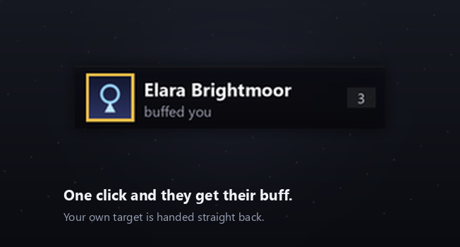
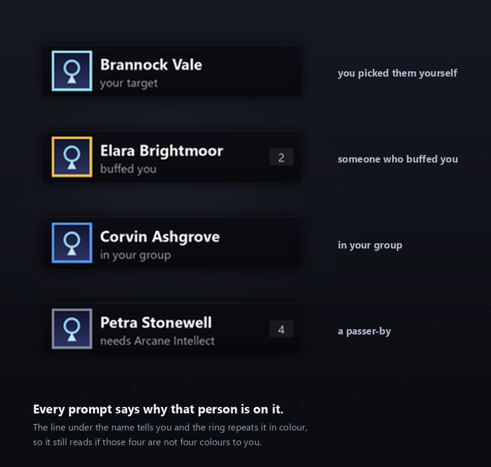

# Manners

**One click to buff back whoever just buffed you** — and nearby players missing
yours.

[](https://github.com/fpsacha/Manners/actions/workflows/ci.yml)
[](https://wow.curseforge.com/projects/1705364)
[](https://addons.wago.io/addons/rNkgzlNa)
[](LICENSE)



A priest buffs you in passing. By the time you have picked them out of a dozen
nameplates, they are gone.

Manners notices, works out what you owe them, and puts one button on screen.
Click it, they get their buff, and your own target is handed straight back.

It also offers nearby players who are missing yours — not to optimise a raid,
just so being the person who buffs strangers costs one click instead of a
minute of squinting at names.

## Installing

**[Wago](https://addons.wago.io/addons/rNkgzlNa)** — and through **WowUp**,
which reads Wago. Search *Manners* and install.

**[CurseForge](https://wow.curseforge.com/projects/1705364)** — and the
CurseForge app.

Both get the same build from the same tag. Wago is the one to use if you manage
addons with WowUp: it dropped CurseForge support when Overwolf cut off
third-party clients, so an addon published only to CurseForge never appears
there.

To install by hand, take a release zip from
[Releases](https://github.com/fpsacha/Manners/releases) and unzip it into
`Interface/AddOns`.

> **Do not install from a clone of this repository.** `Libs/` is deliberately
> not committed — the 14 libraries are fetched at build time — so a zip
> made from a checkout has none of them and will not load. Use a release.

## Which client, and how sure

This is a **beta**, and the reason is worth a sentence before you rely on it:
the code is finished and the suites are green, but **one class on one client
has actually been played**. Everything else is tested against a mock, and a
mock agrees with whoever wrote it.

| | How far it has been taken |
|---|---|
| **Mage, on WoW Forever** | cast in game, repeatedly, against real players |
| Priest, Druid, Paladin, Warlock, Warrior — WoW Forever | spell data corroborated against other addons running on this client, every cast path exercised by the suite, never cast in game |
| Retail, Mists Classic, Classic Era — every class | implemented and exercised by the suite, spell data from the patch notes and the wiki — but nobody involved can launch those clients, so **they are not shipped yet** |

Getting one spell to cast here took ten attempts, on a client that documents
none of its restrictions. Every class uses that same path and their macros are
checked automatically — but "the tests pass" is not "somebody used it". Treat
anything but Mage as unproven, and please
[say so either way](https://github.com/fpsacha/Manners/issues/new/choose):
**it worked** is the more useful report, because it is what moves a class off
this list.

If a buff is never offered, `/manners debug` names any spell id the client does
not actually have, and reports which client it decided it is on.

Hunters and rogues have nothing to cast on another player, and Manners says so
plainly rather than sitting there looking broken.

## What it does

- **Somebody you targeted yourself** → outranks everyone, including a favour
  owed, but only when the game will confirm they are missing it. A guess does
  not get to jump the queue, and with *always offer* chosen nothing is checked,
  so your target waits their turn like anybody else.
- **Someone buffs you** → they go to the top of the queue, tagged as a favour
  owed. It is spotted by watching your own buffs appear and reading who cast
  them, which works on strangers, but only while they are someone the game will
  still name for you. On Classic Era, Burning Crusade and Mists the combat log
  is read as well, and that one can name somebody who has no nameplate at all —
  Forever and retail do not hand addons a combat log, so there the buff watch is
  all there is. The debt is stored per character and survives a reload or a
  disconnect.
- **Your party or raid** → anyone missing your buff.
- **Passers-by** → nearby players missing your buff, seen through nameplates,
  your target, your focus and your mouseover.

Skips the dead, the out-of-range, anyone you just tried, and anyone the buff
does nothing for — Arcane Intellect is wasted on a rogue. Right-click the
prompt to skip somebody without marking their favour repaid.

**Never offer.** Shift-right-click the prompt to put the person on it on a
list of people who are never offered anything, as a passer-by or as a member
of your group. Chat says how to undo it; the list is also on the *Who to buff*
tab, where names can be added, taken off one at a time or cleared. Somebody on
the list who buffs you is still offered the favour back — returning a favour is
the point — and shift-right-clicking them then lets that favour go as well.

**Who comes first.** A friend (Battle.net friends included) or guildmate
passing by goes ahead of the other passers-by, and one in your group ahead of
the rest of your group. It only changes the order: people who buffed you still
come first, so does your target whenever *Whoever I have targeted comes first*
puts them there, and somebody the game says is out of range stays behind
somebody in range. Switch it off under *Who comes first*.

**Passers-by only in cities and inns** is a choice under *Who to skip*, off by
default: out in the world, strangers walking past are left alone, while your
group, anybody who buffed you and whoever you target are still offered.

**How near a passer-by has to be** is its own setting, because being in range
is not the same as being near: Arcane Intellect reaches about thirty yards,
which in a city is everybody on the screen. Choose *anywhere I can cast*
(thirty yards, as it was), *nearby* (about ten, the default) or *right beside
me* (about five). It applies to passers-by only — somebody who buffed you was
close enough a moment ago, your group is your group, and whoever you have
targeted or focused you picked on purpose.

The game will not say how far away a player is, so this is measured with
whatever the client offers — LibRangeCheck if it is there, the client's own
interact distance otherwise — and lands on the nearest step that has. Where
nothing can measure at all, everybody in casting range is offered as before.
`/manners debug` says which of those is in use and how often it answers.

**If they already have it**, you choose: leave them alone, offer a top-up once
their timer drops below a threshold you set, or always offer regardless.
Somebody who buffed you is offered the favour back either way, even if they
already have it — recasting it only refreshes it.



<details>
<summary><strong>Which buffs each class offers, per client</strong></summary>

Which spells exist depends on the client, so the tables do too. `/manners debug`
prints the set it chose, and the Diagnostics tab lists what your class has.

**Vanilla content** — Classic Era, Burning Crusade Classic, WoW Forever:

| Class | Buffs offered |
|---|---|
| Mage | Arcane Intellect |
| Priest | Power Word: Fortitude, Divine Spirit, Shadow Protection |
| Druid | Mark of the Wild, Thorns |
| Paladin | Wisdom, Might, Kings, Salvation, Light, Sanctuary |
| Warlock | Unending Breath |
| Warrior | Battle Shout (party only) |

**Mists of Pandaria Classic** — 5.0.4 deleted the duplicates within each class
and folded the raid-wide versions in, so every class has one or two:

| Class | Buffs offered |
|---|---|
| Mage | Arcane Brilliance |
| Priest | Power Word: Fortitude |
| Druid | Mark of the Wild |
| Paladin | Kings, Might |
| Monk | Legacy of the Emperor, Legacy of the White Tiger |
| Warlock | Dark Intent (Unending Breath is offered only if you pin it) |
| Warrior | Battle Shout (party only) |
| Death Knight | Horn of Winter (party only) |

**Retail** — Midnight. Five class buffs are left in the game, and paladins,
death knights, monks and warlocks have nothing they can put on a passer-by:

| Class | Buffs offered |
|---|---|
| Mage | Arcane Intellect |
| Priest | Power Word: Fortitude |
| Druid | Mark of the Wild |
| Shaman | Skyfury |
| Evoker | Blessing of the Bronze, Source of Magic (if talented) |
| Warrior | Battle Shout (party only) |

Where a class has more than one, the prompt offers whichever they are actually
missing, in list order: a priest walks Fortitude, then Divine Spirit, then
Shadow Protection. Somebody holding the first is still offered the second
rather than dropping off the list. Individual buffs can be switched off, or one
pinned so that is the only thing ever cast.

Paladins are the exception. Blessings overwrite one another, so holding any one
of yours counts as covered and walking the list would mean replacing a blessing
somebody already has. The automatic pick is Wisdom for anyone with a mana bar
and Might for everyone else.

Battle Shout reaches your party and nobody else, so a warrior outside a group
is offered nobody. That is deliberate rather than a fault.

</details>

## Why a button and not automatic

Blizzard does not let an addon cast a spell on its own — `CastSpellByName` is
protected and only runs from a hardware event. This has been true since patch
2.0 and no addon gets around it.

So Manners does everything except the keypress. It decides who deserves the
buff and writes that decision onto a secure button; the *game* casts when you
click. That split is deliberate on Blizzard's part and it is why the prompt
also freezes during combat.

## Speech

Optionally say something when you buff somebody, with a randomised phrase list.

The line rides along in the macro the button runs rather than going through the
chat API — the game refuses addon-sent `/say` outside instances, which is
exactly where someone buffs you in passing. Through the macro it counts as you
talking.

Off by default, and when on it defaults to speaking only when returning a
favour.

## Usage

```
/manners           options
/manners welcome   what it does and the one thing it needs from you
/manners unlock    drag the prompt, then /manners lock
/manners test      preview, for styling without waiting for a real entry
/manners never     who is never offered anything; /manners never <name> adds
/manners allow <name>  takes somebody off that list
/manners debug     what your class and this build allow
/manners errors    the last few things that broke, if any did
```

The first login on a character says all of that by itself, once, and puts the
prompt on screen so you can see where it is. It is kept per character rather
than per profile: every character starts on the one shared profile, so a flag
there would greet whoever logged in first and nobody else — and what it asks
for (a macro on this character's bars, or a key bound) is per character too.

`/manners` with anything it does not recognise lists the rest.

Put it on a bar with a macro containing `/click MannersPrompt LeftButton 1`
(`/manners macro` makes one), or keybind under
**Options → Keybindings → Manners** ("Buff the prompted player"). The trailing `1` is the down flag: the
secure button only casts on the way down.

## Notes on WoW Forever

This client differs from other flavours in ways that are not documented
anywhere, and each one took a live test to find.

**Conditional targeting does not work.** `[@unit]`, `[@Name]`, `[@focus]`,
`[@mouseover]` and the secure `unit` attribute all fail, silently or with "You
have no target". A bare `/cast` with no target works fine, so this is
specifically about naming another unit. Two of those would not have worked
anywhere: `[@Name]` resolves only for somebody already in your party or raid on
every flavour, and `[@nameplateN]` resolves on none of them. Which is why the
macro is the same everywhere — targeting the person by name, casting, and
handing your target back is the only shape that reaches a passing stranger on
any client. The macro uses `/target`, which matches a name *prefix*, so
offering Mort could find Mortimer standing next to him. Where the client names
who received the spell, the addon notices the cast landed on somebody else and
says so; this client usually doesn't, and then the favour is counted as repaid
on the strength of the `/target` line alone. `/targetexact` is
detected (`/manners debug` reports it) but not used yet: it finds nobody at all
if the name is one character out, and the surname spelling the addon assembles
has not been checked against it in game.

**Secure buttons must register for mouse down.** Registering up only leaves the
click arriving and the attributes correct while the game casts nothing and
reports nothing. Every secure button that works here registers `"AnyDown"`.

**Unit power is a secret value** for players outside your group, so "does this
person have mana" cannot be read directly. Class is used instead, which is
accurate for every vanilla class.

**`UnitName` returns a surname, not a realm**, in its second value. Joining
them with a hyphen produces names that no targeting call resolves. Surnames are
this client's alone: on the other four that second value is the realm, present
only for a cross-realm player, and there the two join with a hyphen — a space
would make a name nothing can find. The addon branches on the flavour for this,
because both values are plain strings and neither says which it is.

**Nameplate unit tokens are secret** when read off the frame via
`C_NamePlate.GetNamePlates()`. The token passed to `NAME_PLATE_UNIT_ADDED` is
not, so that is what to track.

**There is no combat log.** Registering `COMBAT_LOG_EVENT_UNFILTERED` is
refused here; Blizzard ships `C_DamageMeter` instead. That is not a Forever
quirk — retail 12.0+ refuses it too, and only Classic Era, Burning Crusade and
Mists still have one. So a favour is spotted by watching your own buffs appear
and reading `aura.sourceUnit`, which is a unit token: somebody with no
nameplate who is not your target cannot be identified at all. Nothing can be
done about that from an addon here. Where there *is* a log, Manners registers
it as a second source and that person can be named after all —
`SPELL_AURA_APPLIED` carries their GUID, and `GetPlayerInfoByGUID` turns a GUID
into a name and a class with no unit token. The aura scan stays the spine
either way; the log only ever adds.

## Building a release

Full checklist in [RELEASING.md](RELEASING.md).

`Libs/` is deliberately not in the repository: `.pkgmeta` declares all 14
libraries as build-time externals, so the packager fetches current upstream
copies under their own licences.

**A zip built from a clone therefore has no libraries and will not load.**
Write the notes under `## Unreleased` in `CHANGELOG.md`, set the version, push
master, and once CI is green tag it and let the workflow build it:

```
python tests/setversion.py X.Y.Z-beta.N
git commit -am "Manners X.Y.Z-beta.N"
git push origin master
git tag vX.Y.Z-beta.N && git push origin vX.Y.Z-beta.N
```

A tag pushed without notes, or pushed together with master before CI has
passed, fails its build and stays on origin; RELEASING.md says how to take it
off.

`.github/workflows/release.yml` runs the test suites, fails the build if any
check has stopped being able to detect the fault it exists for, then packages
and publishes a GitHub release and uploads to **CurseForge and Wago** from the
one tag.

A destination needs both a token in the repository secrets (`CF_API_KEY`,
`WAGO_API_TOKEN`, `WOWI_API_TOKEN`) and a project id in the toc
(`X-Curse-Project-ID`, `X-Wago-ID`, `X-WoWI-ID`). Missing either skips that
upload in a way that reads exactly like success, so the build log names which
half is absent.

## Tests

```
python tests/validate.py       structure, syntax, and version consistency
python tests/runharness.py     load the addon against a mock client
python tests/runscenarios.py   adversarial scenarios
python tests/selftest.py       confirm the suites can still go red
```

All four run on every push via `.github/workflows/ci.yml`, and again as a gate
before any release. See `tests/README.md`.

## Listing images

The CurseForge icon and the screenshots are generated, not captured — see
`tools/README.md`. They read the prompt's real defaults out of `Core.lua` and
its colours out of `Prompt.lua`, and CI fails if any of those can no longer be
found, so they cannot advertise a layout the addon does not draw.

## Licence

MIT, see `LICENSE`. Bundled libraries keep their own terms — see
`THIRD-PARTY-NOTICES.md`. LibSharedMedia-3.0 is LGPL v2.1.
