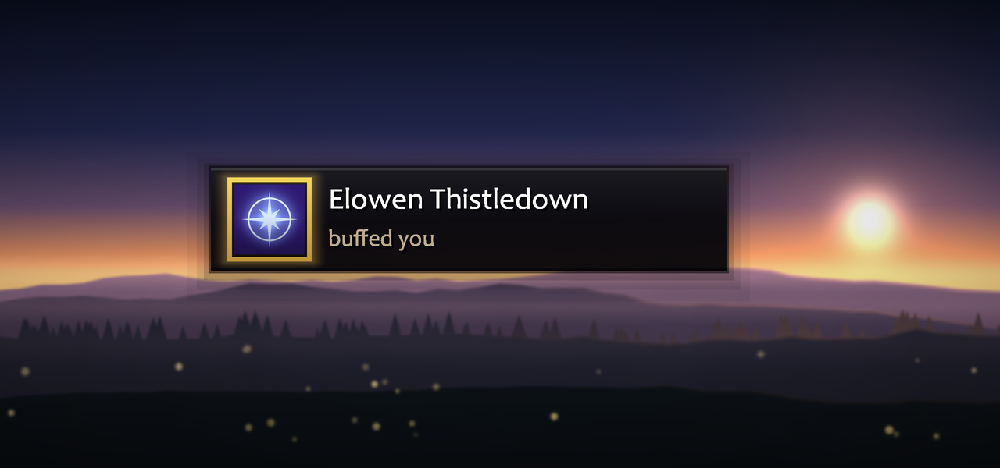
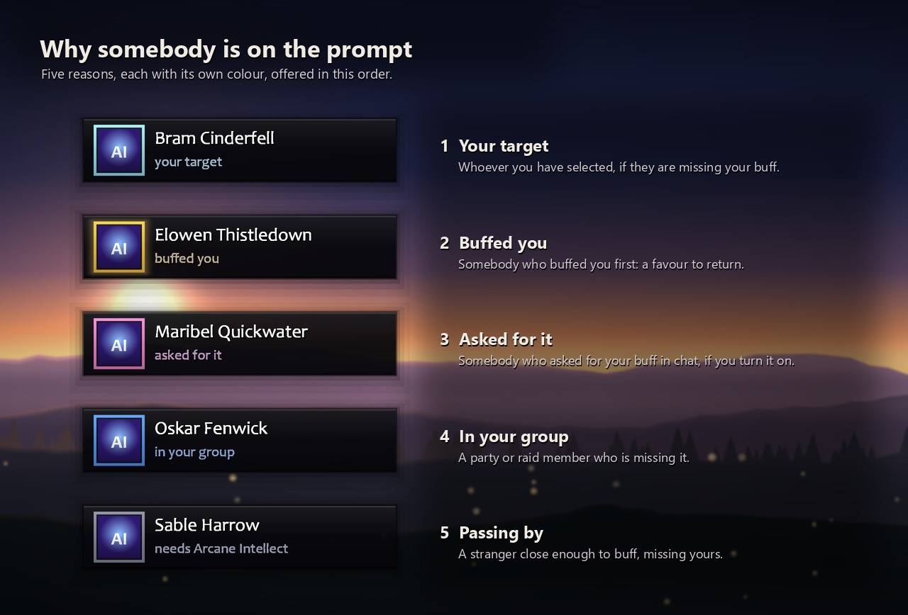
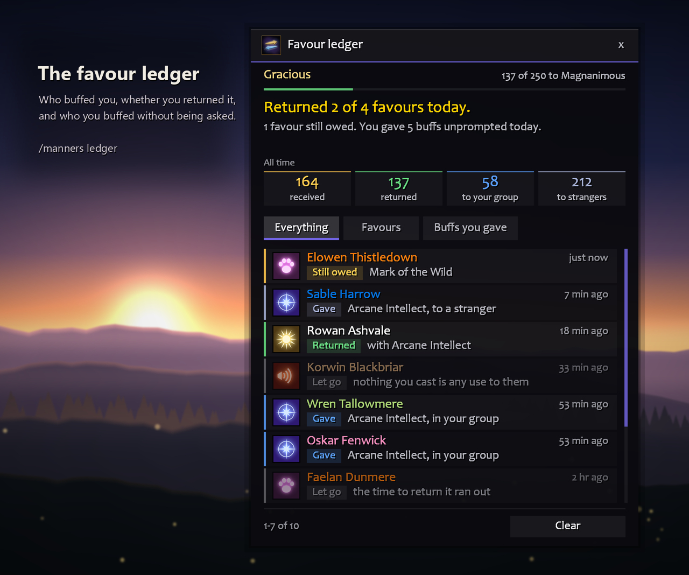
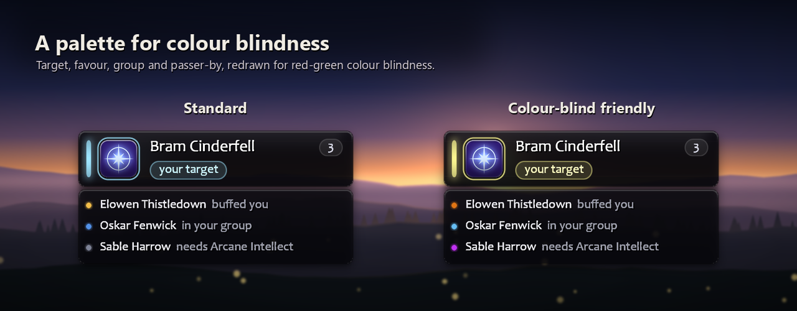
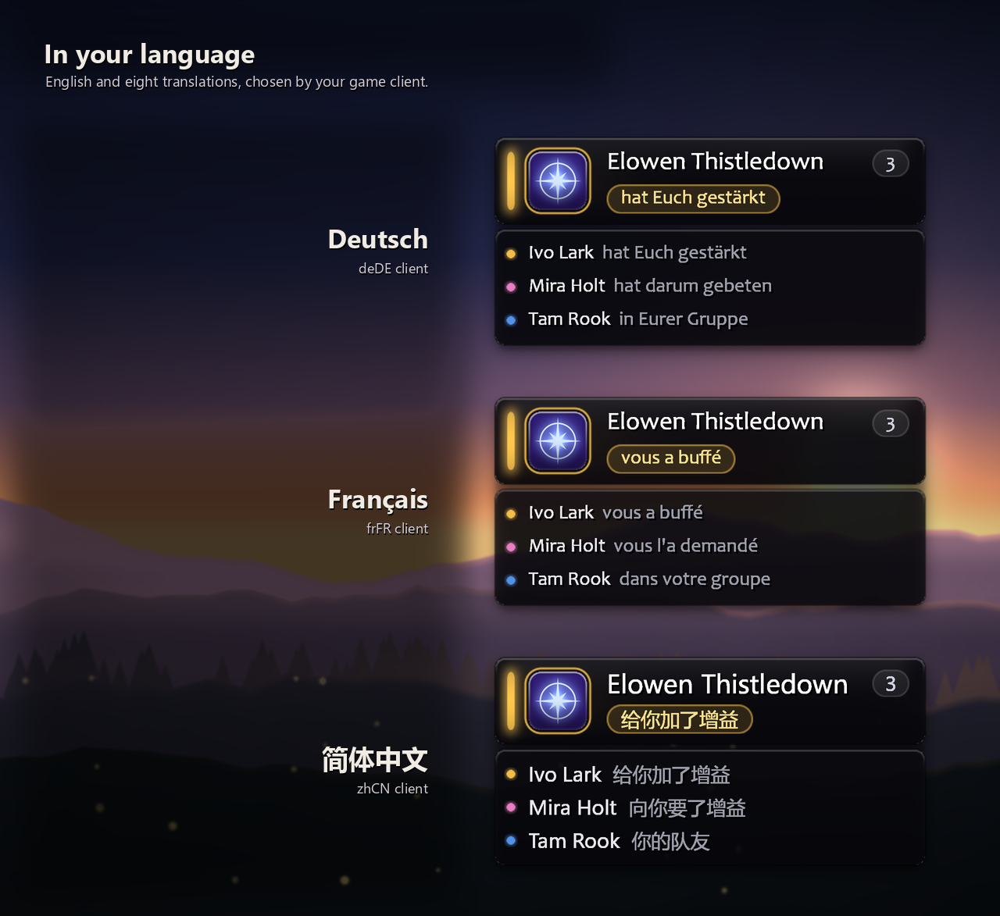

# Manners

**One click to buff back whoever just buffed you, and nearby players missing
yours.**

[](https://github.com/fpsacha/Manners/actions/workflows/ci.yml)
[](https://wow.curseforge.com/projects/1705364)
[](https://addons.wago.io/addons/rNkgzlNa)
[](LICENSE)



A priest buffs you in passing. By the time you have picked them out of a dozen
nameplates, they are gone.

Manners notices, works out what you owe them, and puts one button on screen.
Click it, they get their buff, and your own target is handed straight back. It
also offers your group, people who ask for your buff in chat, and nearby
players who are missing it, so being the person who buffs strangers costs one
click instead of a minute of squinting at names.

In a dungeon or a raid it keeps the group topped up: one group cast for a
whole party when you carry the reagent, your group first at a ready check and
after a wipe, and only the raid groups you were given.

It looks after you too. When you are missing your own buff, or one your class
casts only on itself (a mage's armor, a priest's Inner Fire, a paladin's aura,
a hunter's aspect, a shaman's shield), "You" comes up on the same prompt and
one press puts it on you. A mage carrying familiar or weapon imbue scrolls is
reminded of those too.

Built for **WoW Forever** (Interface 16001) and **Classic Era** (Interface
11509).

Retail and Mists Classic are implemented too, but not shipped yet.

## Installing

- **[Wago](https://addons.wago.io/addons/rNkgzlNa)**, and through it
  **WowUp**: search *Manners* and install. WowUp dropped CurseForge when
  Overwolf cut off third-party clients, so Wago is the one it reads.
- **[CurseForge](https://wow.curseforge.com/projects/1705364)**, and the
  CurseForge app.
- **By hand**: take a zip from
  [Releases](https://github.com/fpsacha/Manners/releases) and unzip it into
  `Interface/AddOns`.

All three carry the same build from the same tag.

> **Do not install from a clone of this repository.** `Libs/` is deliberately
> not committed (the libraries are fetched at build time), so a zip made from
> a checkout has none of them and will not load. Use a release.

## First steps

Open the options with `/manners`, or click the minimap button. The first
time, on a new profile, the window opens on **Start here** with two
questions at the top under *Quick setup*: *Who do you want to buff?* (people
who buff you, your group too, everyone near you, or your group kept topped
up for dungeons and raids) and *Should your character talk?* (stay silent,
just `/thank` them, a polite line, or in character). *Done* sets them as the
choices on Start here and What I say would; *Skip* leaves everything as it
is. Either way they are not asked again on that profile, and a profile you
already had is never asked. Below them, Start here has two steps:

1. **Who to buff.** One quick choice, *Offer my buff to*, already answered:
   a new profile starts on *Everyone near me*, and the line under it says
   what that comes to. The rest is on the *Who to buff* page.
2. **Put it on a key.** Set the key right there, or bind one under
   **Options > Keybindings > Manners** ("Buff the prompted player"). Or press
   *Make a macro* (or type `/manners macro`) and drag the macro onto a bar.
   The macro is `/click MannersPrompt LeftButton 1`; the trailing `1`
   matters, because the secure button only casts on the way down.

Then press *Show me the prompt* at the top of the window (or type
`/manners test`) to see it where it sits. *Where it sits* has three
ready-made places, on the *Look* page beside *Lock position*; `/manners
unlock` lets you drag it, and it locks again when you let go. To `/thank`
people or say a line when you buff them, see *What I say*.

The first login on each character says what the addon does and what it needs
from you, once, and shows the prompt so you can see where it is.
`/manners welcome` says it again.

## What it does



Everybody who could use your buff is queued, in this order:

1. **Your target**, when the game can confirm they are missing it. A guess
   does not get to jump the queue.
2. **Your party or raid at a ready check, or just back from the dead**, when
   they are read as missing your buff or running low on it (see *Dungeons
   and raids* below).
3. **Somebody who buffed you.** Spotted by watching your own buffs appear and
   reading who cast them, which works on strangers too, as long as the game
   can still name them for you. The favour survives a reload or a
   disconnect.
4. **Somebody who asked for it in chat**, if you switch that on (see below).
5. **You**, when you are missing your own buff or one of your class's own
   (see *Buffing yourself* below).
6. **Your party or raid**, anyone missing your buff.
7. **Passers-by** missing your buff, seen through nameplates, your target,
   your focus and your mouseover.

It skips the dead, the out-of-range, anyone you just tried, anyone the buff
does nothing for (Arcane Intellect is wasted on a rogue), and, while you are not
flagged yourself, anyone flagged for PvP, since buffing them would flag you.

**On the prompt:** left-click (or your key) casts. **Right-click** skips that
person for now without marking their favour repaid. **Shift-right-click** puts
them on the never-offer list.

**Buffing yourself.** When you are missing the buff you give others, "You"
comes up on the prompt with "your own Arcane Intellect" under it, and a press
casts it on you and hands your target back: nothing is said, and nothing goes
in the ledger. With it come the buffs your class casts only on itself, once
you have learned them: a mage's armor, a priest's Inner Fire, a warlock's
Demon Skin or Armor, a paladin's aura and Righteous Fury, a hunter's aspect
and Trueshot Aura, a shaman's shield (the full list is under *Which buffs
each class offers*).

- One at a time, your buff for others first: a mage missing both is offered
  Arcane Intellect, then the armor.
- Only when **none** of a kind is up, so the armor, aura or aspect you chose
  is never swapped for another. Only yours count: another paladin's aura on
  you does not stop the reminder. But two of the same aura do not stack, so
  Automatic passes over one that already reaches you from another paladin (or
  an Aspect of the Wild or a Trueshot Aura from another hunter) for the next
  you know, and offers nothing when there is none.
- Where your class has several of one kind, you pick one, or leave it on
  *Automatic*, which reminds you of the one you had up last (read from your
  own buffs, even if you changed it in a fight or in town). Until you have had
  one up, a mage gets Mage Armor in a dungeon or raid and Frost or Ice Armor
  elsewhere, a paladin Devotion Aura and a hunter Aspect of the Hawk.
  Automatic never picks the Cheetah or the Pack, but with either up you are
  not reminded. Righteous Fury on Automatic waits until your group role is
  tank.
- Never in a fight, and not in cities and inns unless you tick *Also in
  cities and inns*; that goes for your buff for others too. Nothing is offered
  while the game says the spell cannot be cast (a druid in cat form, a priest
  in Shadowform, a mage out of mana).
- With *Offer a top-up when it runs low*, a buff with a timer is also offered
  when it is running out; an aura or an aspect never is. So is Lightning
  Shield or Shadowguard down to its last charge, and Inner Fire down to its
  last five, after a fight.
- **A mage's scrolls.** *Familiar* reminds you when no familiar is with you
  and a Rat, Frog or Cat Familiar scroll is in your bags; *Weapon imbue* when
  nothing is on the weapon in your main hand and you carry an imbue scroll
  that fits it (Lesser Flame on a staff, Chillknife on a dagger, Spark on a
  one-handed sword, and so on). A wizard oil or any other temporary enchant
  counts as something on it, until the game has shown a scroll's imbue on the
  weapon beside one: from then on, for the session, the oil alone no longer
  counts, so a scroll whose imbue ran out under it is offered again. A scroll
  is offered only once your level is up to it, with
  its own icon, and one press uses it from your bags: your target is not
  touched. Its use takes three seconds, and if moving cuts it short the scroll
  is offered again a moment later. *Automatic* takes the one you used last
  while you still have one that fits, otherwise the best your level and weapon
  allow. A top-up is of the enchant you are wearing: Spellbreak and Lesser
  Flame make the same one, so either tops it up once the other is used up. A
  mage with no scrolls sees nothing of this.
- *Save mana* never holds you back, and nor does *Raid groups I buff*. In a
  party you count towards a group buff, and the group cast covers you.
- A warrior's Battle Shout already covers the warrior and nobody needs Unending Breath
  on dry land, so neither is offered to you. A paladin wearing one of their
  own blessings is not offered another.
- Right-click "You" to skip it for now. Shift-right-click switches *Myself*
  off, since the never-offer list is for other people, and chat says where to
  switch it back on.
- `/manners debug`, and the lines under *Myself* on the *Who to buff* page,
  say which of your own buffs is up, which is due, and why one is not being
  offered.

**Group buffs.** Once you know the group version of your buff (Arcane
Brilliance, Prayer of Fortitude, Prayer of Spirit, Prayer of Shadow
Protection, Gift of the Wild) and carry its reagent, a party with enough
people missing it gets one cast instead of one each. Three is the default,
and *When this many need it* sets 2 to 5. In a raid the whole raid is
counted together, because on WoW Forever the spell reaches everybody in
your party and raid within 100 yards. A paladin's Greater Blessings go by
class across the group instead, and are held back while anybody of that
class carries another of your blessings, which the Greater one would
replace. The prompt names who it is for ("Your party", "Your raid",
"Every Warrior") and why ("Arcane Brilliance -- 4 missing", "4 running
out"), and the tooltip counts your reagents. A
right-click skips the cast for the whole group; a shift-right-click puts only
the person it is aimed at on the never-offer list. Short of mana for the
group spell, you are offered the single one. With the chat lines on, chat
says when you are down to 5 reagents and when you run out, after which the
prompt goes back to one person at a time. With the Legacy perk Reagent
Economy you need no reagent at all: the group cast is offered with none in
your bags, and the tooltip says no reagent is needed. Nothing changes until
you have learned a group buff and carry its reagent or have the perk.

**Dungeons and raids.**

- *My group first at a ready check*: from the check until the pull (or a
  minute after everybody has answered, if nobody pulls), your party or raid
  goes to the front, behind only your own target. The prompt says "ready
  check".
- *Group members just revived first*: for two minutes after somebody in your
  group is brought back, they go to the front. A hunter getting up from Feign
  Death does not count.
- Both are on by default and only change the order: nobody is added, and
  only somebody whose buffs were read goes forward.
- *Raid groups I buff*: untick the groups you were not assigned. In a raid,
  their members are offered only if they buffed you, asked, or you target or
  focus them. `/manners debug` lists the groups still ticked, even outside a
  raid, so you can check before the pull.
- *Save mana: stop below (% mana)*, off by default: below it, only your own
  buffs and people who buffed you or asked are offered, and your group, your
  target and passers-by wait until your mana is 5 points above it, so the
  prompt does not flicker between casts. The tooltip, a press on the empty
  prompt and `/manners debug` say when they come back.
- In a raid group, a battleground or an arena the "buffed you" chat line is
  not printed, and in a dungeon it waits out the fight. The favour is still
  noticed and offered. A group member whose buff lands again every few
  minutes (a warrior's shout) gets the line once in half an hour, and while
  they wear your own buff with more than the top-up time left, their favour
  is not offered back: there is nothing to repay.

**Never offer.** People on the list are never offered anything, as passers-by
or as group members. Somebody on it who buffs you is still offered the favour
back, because returning a favour is the point; shift-right-click them again to
let that favour go. Your `/ignore` list goes further: nobody on it is
thanked, offered a favour back or offered as a passer-by, though a group
member on it still is. The list is on the *Who to skip* page, and `/manners never`
and `/manners allow <name>` work from chat. In a fight the prompt cannot move
off the person it is showing, so a press still casts at them until the fight
ends, and chat says so.

**Friends and guildmates first.** A friend (Battle.net friends included) or
guildmate goes ahead of the other passers-by, or of the rest of your group. It
only changes the order: people who buffed you still come first, and somebody
known to be out of range never leads over somebody in range.

**People who ask me for it.** Off by default, because reading chat is
guesswork. Somebody who asks for your buff in `/say`, `/yell`, group chat or a
whisper ("int pls", "fort?", "can I get motw", or the spell's name in your
language) is offered it for the next minute, after people who buffed you and
before your group. Nothing is ever said back. What counts:

- eight words at most, naming the buff as a whole word, with nothing like
  *no* or *not* in it;
- a please, a question mark, an opener like *can I* or *anyone*, or nothing
  but the buff's name;
- beside a nickname (*int*, *fort*) or *buff*, only small words like *me*,
  *get* or *pls*, so "int the healer" asks for nothing;
- words English uses for other things (*might*, *mark*, *wisdom*, *spirit*,
  *shadow*) need a please or to stand alone, and never count in group chat;
- nobody of your own class counts as asking (another mage saying "anyone need
  int?" is offering it), and nothing said in a fight counts unless it was
  whispered. A request still waiting when a fight starts waits until it ends.

They must still lack the buff and be somebody the game can see.
`/manners debug` lists the requests still standing.

**Snooze, and hiding while mounted.** `/manners snooze` hides the prompt for
15 minutes; `snooze 5`, `snooze 1h` (up to four hours) or `snooze off` for
your own. The minimap menu and the *Snooze* button at the top of the options
window have it too. Favours are still noticed while snoozed. A `/reload` ends
a snooze, and one started in a fight takes effect when the fight ends. *Hide
the prompt while I'm mounted* (When to offer page, off by default) keeps the
prompt away while you ride and brings it back when you get off. Press the key
while either is hiding the prompt and chat says which.

## The favour ledger



Who buffed you, with what and when, whether you returned it, and who you
buffed without being asked, newest first. Today's count ("Returned 12 of 14
favours today") and the all-time totals sit at the top, then tabs for
everything, favours, and buffs you gave. A favour you did not return says why:
the time ran out, nothing you cast helps them, or you put them on the
never-offer list. Hover a favour still owed and it says whether the prompt will
offer it, and when. A group buff counts as one buff given and says how many
who needed it got it; the favours it returned are marked returned.

**Titles.** Favours you return earn you a title: *Well Brought Up* at 10, then
*Well Mannered*, *Courteous*, *Gracious* at 100, *Magnanimous*, *Paragon of
Etiquette* and, at 1,000, *The Very Soul of Courtesy*. The one you hold sits at
the top of the ledger with how far you are from the next ("37 of 50 to
Courteous"), and in the minimap tooltip. A new title gets one line in chat,
once, even with chat lines off; a character that had earned some before titles
existed simply has them.

`/manners ledger`, a shift-click on the minimap button, or *Open the ledger* on
the Start here page, where it opens above the options. It keeps the last 200
entries per character; *Clear* empties the list and today's count but keeps
favours still owed, the all-time totals and your title. It opens in combat,
and the only thing it ever says in chat is a new title.

## The prompt's look

Six looks -- Glass (the default), Framed, Minimal, Luxe, Toast and Arcane,
under Look > Style > *Panel style* -- your own colours and fonts, and
LibSharedMedia support. When a buff lands, a ring pops out of the icon and
light crosses the panel; a refused one gives the text a small shake. Somebody
who buffs you makes the panel catch the light, and the prompt fades out after
your last buff. The icon shows the global cooldown sweep, like an action bar.

**Text follows the panel.** Leave the text colour at white and it turns dark
by itself on a light panel colour, and class-coloured names that would vanish
on it are darkened too. Any other text colour is used exactly as picked. The
minimal look outlines its text so it reads over snow as well as in the dark.

**A colour-blind palette.** *Reason colours*, under Look > Style, swaps the
four reason colours for pale yellow, orange, sky blue and violet, which stay
apart under protanopia and deuteranopia.



Set *Animations* to *Calm* for none of that movement. *Keep the prompt dim and
still in combat* does what it says for a fight.

## The minimap button

A click opens the options, a shift-click the ledger, and a middle click
switches Manners on or off. Right-click for a menu: on or off, snooze (5
minutes to an hour), who is next (skip one, or never offer them anything), the
ledger, a preview, the prompt's lock, position, sound and effects, the chat
lines, and your profiles when you have more than one. In a fight the entries
that would move the prompt wait until it ends.

The icon dims while snoozed and goes darker still while off. A broker display
shows how many people who buffed you are still waiting. The same launcher is in
the **addon compartment** under the minimap, so hiding the button loses
nothing.

## The options

`/manners` opens the options window on the page you used last (*Start here*
the first time). Drag it by its title bar; Esc closes it. The game's own
**Options > AddOns > Manners** has a button that opens it too. Most settings
explain themselves; this is what their tooltips have no room for.

**On every page.**

- Along the top: *Show me the prompt*, *Snooze* (5, 15 or 30 minutes; while
  one runs the button says until when, and its menu can stop it) and *Manners
  is on*. A character with nothing for the prompt to show, such as a rogue,
  has only the switch.
- Under them, a line appears only while something keeps the prompt from
  doing what you would expect: Manners is off, the prompt is unlocked (with
  *Lock it* at the end of the line), a snooze is running, nothing can be
  offered, or the prompt is kept away while you are mounted. In a fight it
  also says that the changes on the open page wait for the fight to end.
- On the left, the pages: *Start here*; *Who to buff*, *Who to skip*, *When
  to offer*, *What I say*, *Look*; *Profiles*, with the profile in use under
  its name, and *Diagnostics*. A page with nothing for your character is left
  out, so a rogue has *Start here*, *What I say* (with only the `/thank` on
  it), *Profiles* and *Diagnostics*. A red dot
  beside a page means something there wants looking at: no key yet, nothing
  that can be offered, *Always offer* picked, a sound set to *None*, a marker
  colour with nothing left to colour, or something broken this session.
- The search box above the pages finds a setting by its name, its tooltip,
  one of its choices ("whisper" finds *Where to say it*) or the section it is
  in, capitals or not, in every language Manners is translated into. Pick a
  result (Enter takes the first) and the window goes there, opens the
  section it is in and flashes it.
- Each page starts with what most people change. Under a thin line, "The
  defaults suit most players; change these only if something bothers you.",
  come folded sections for fine-tuning: click one to open it, and it is still
  open next time. A gold dot on a folded section means something in it is not
  at its default.
- *Put these back to default*, bottom left, resets the page you are on, after
  asking. It keeps where the prompt sits and its lock, the lines you wrote,
  the never-offer list, your key and *Manners is on*. *Start here*,
  *Profiles* and *Diagnostics* have no reset. The version number sits at the
  bottom too, for bug reports.
- A change on *Look* shows on the prompt itself: while you drag a slider
  there, and for a moment after any other change, the window fades so you can
  see the prompt behind it. Resting the pointer on *Show me the prompt* while
  the prompt is showing does the same. Opening *Look* out of a fight shows
  the prompt.

**Start here.** The two steps, the favour ledger, and *Minimap and chat*.

- *Quick setup*, at the top, only on a profile that has never been set up
  (see *First steps*): the quick choices below and on *What I say*, put as two
  questions, with *Done* and *Skip*. A class with nothing to give is not asked.

- *1. Who to buff*: *Offer my buff to* is a quick choice. *Only people who buff
  me*; *People who buff me, and my group*; *Everyone near me* (a new profile's
  defaults); or *My group, kept topped up (dungeons and raids)*, which also
  offers a top-up when a buff runs low. Each sets a few switches on *Who to
  buff* and *When to offer*, and the grey line under it says what they add up
  to. *Only people who buff me* also switches *Myself* off, and the other three
  switch it on. It never touches *People who ask me in chat*, the group buffs
  or who comes first. When the switches match none of the four, it reads
  *Custom (changed by hand)*. A hunter or a shaman, with nothing to give
  anybody else, gets no choice here, just a line naming the buffs of their own
  the prompt reminds them of.
- *2. Put it on a key*: the key is saved with your game key bindings, so it
  follows every profile. *Make a macro* also opens the macro window, so the
  macro is there to drag. The line under them says whether you are ready.
- *Minimap and chat*: the minimap button, and *Tell me in chat what Manners is
  doing*. That is a line in your own chat when somebody buffs you, when a
  favour is repaid, and when a click fails. Use it to tell "the buff was never
  noticed" from "it was noticed but they could not be reached"; nothing from
  it is ever said to anybody else.

**Who to buff.**

- *Buff to offer*: automatic, or pin one spell. A pinned spell is the only one
  considered, so if you have not learned it there is nothing to fall back to.
  Where a class has several buffs, automatic offers whichever one they are
  missing, in list order: a priest walks Fortitude, then Divine Spirit, then
  Shadow Protection. Under it, one switch per buff; untick one to never offer
  it. A class with a single buff reads "You offer Arcane Intellect." instead
  of a dropdown.
- *Automatic for paladins*: blessings overwrite one another, so anybody
  already carrying one of yours is left alone rather than handed a different
  one. The pick is Wisdom for anyone with a mana bar and Might for everyone
  else. Under *Always offer*, or where the game hides which blessing they
  carry, the first blessing that suits them is offered, and it can replace
  yours.
- *Offer my buff to*: *People who buff me*, *My party and raid*, *Passers-by
  (players near me, not in my group)* and *People who ask me in chat*.
- *Passers-by within*: *Anywhere I can cast* (about thirty yards), *Nearby*
  (about ten, the default) or *Right beside me* (about five). Only passers-by
  are measured: somebody who buffed you was close enough a moment ago, and
  your group and whoever you targeted or focused were picked on purpose. The
  game gives no exact distance, so this lands on the nearest step the client
  can measure (LibRangeCheck, or the client's interact distance); where
  nothing can measure, everybody in casting range is offered.
- *Only in cities and inns*: off by default. Out in the world passers-by are
  left alone; everybody else is still offered.
- *Myself* (see *Buffing yourself* above): *Myself, when I'm missing my own
  buff*, on by default, switches everything on yourself on or off. Under it,
  one control for each of your class's own buffs you have learned: a
  drop-down where there is a choice (a mage's *Armor*, a paladin's *Aura*, a
  hunter's *Aspect*, a shaman's *Shield*) with *Automatic*, each spell you
  know and *Don't remind me*, and a checkbox for a buff on its own. Automatic
  says what it would pick right now, such as *Automatic (Mage Armor, the one
  you had up last)*. Righteous Fury's is *Automatic (only while I'm the
  tank)*, *Always* or *Don't remind me*. A mage carrying scrolls also gets
  *Familiar* and *Weapon imbue*, which list every scroll of their kind, carried
  or not; one picked with none in your bags waits until you have one, and one
  picked above your level (a profile shared with a higher mage) gives way to
  *Automatic* until you reach it. Then
  *Also in cities and inns*, off
  by default, and last what each of your own buffs is doing and why one is
  not being offered. A warrior or a rogue, with nothing to put on himself
  alone, does not see this part; a hunter or a shaman sees only this part of
  the page.
- *My group and raid*: *Use group buffs* and *When this many need it* (see
  *Group buffs* above), with how many reagents are in your bags, shown only
  to classes with a group buff; and *Raid groups I buff*.
- *Who comes first* (folded): *My target first*, *Friends and guildmates
  first*, *My group first at a ready check* and *Group members just revived
  first*. With *My target first* off, or under *Always offer* (nothing is read
  then), your target is ranked by why they are on the list like anybody else.
  A targeted stranger whose buffs cannot be read counts as a passer-by, so a
  friend goes ahead of them.

**Who to skip.** The switches that leave people out, and the never-offer
list. They used to be at the bottom of *Who to buff*.

- *Skip players flagged for PvP* (on): buffing somebody flagged flags you too,
  so while you are not flagged, nobody flagged is offered -- not even a favour
  back, which waits for their flag to drop. It steps aside while you are
  flagged yourself, as in a battleground, but not while your own flag is
  running out, since a buff would start it again. A group spell or a shout
  that would land on somebody flagged is held back too. Under it, who it is
  holding back right now.
- *Skip my own class when they can cast it too*: off by default. Another mage
  can give themselves Arcane Intellect, so they are left out, unless they are
  too low a level for the rank you cast. Somebody who buffed you, asked, or
  you targeted is always offered. Every priest and paladin trains Divine
  Spirit and Kings on WoW Forever, so those are skipped the same way.
- *Skip players out of range*: where the game cannot tell, they are still
  offered. A group member the game cannot see at all (still in town, or far
  off in the instance) is left out.
- *Skip players below level*: read off the unit, so somebody known only by
  name (the usual case for a passer-by who buffed you) cannot be checked and
  is offered anyway.
- *Never offer*: one row per name, with an X to take it off, then a box to
  add a name and *Clear the list*.

**When to offer.**

- *If they already have it*: *Skip them*, *Offer a top-up when it runs low*
  (then *Top up when less than this is left (minutes)*), or *Always offer*.
  Somebody who buffed you is offered the favour back whichever you pick. Your
  own buffs are always read, so you are never offered one you are wearing;
  a top-up reaches them too, but never an aura or an aspect. A rank below
  the one your cast would land (a level-60 wearing Fortitude's second rank)
  counts as not having it, for you and for them.
- *Hide the prompt while I'm mounted*: dead, on a flight path or in a vehicle
  the prompt already stays away, because nothing can be cast there.
- *Save mana: stop below (% mana)*: 0 is off (see *Dungeons and raids*
  above). Classes without mana do not see it, and nor do hunters and shamans,
  whose prompt is for their own buffs alone.
- *Favours*: how long somebody who buffed you is offered one back.
  - *Offer a buff back for (seconds)* (120): somebody the game can still see
    stays on the prompt this long; somebody it cannot see is let go sooner,
    when *Let them go after* is shorter.
  - *Ignore shields, heals and trinket procs*: only class buffs such as
    Fortitude, a Fear Ward or a Soulstone count as a favour to return, or to
    `/thank`. A paladin's aura, a hunter's aspect or Trueshot Aura reaching
    you never counts, ticked or not.
  - *Stop sooner if they are probably gone* and *Let them go after (seconds)*
    (45): somebody who buffed you is rarely your target or on a nameplate, so
    all that is known is that they were in range when they buffed you. The
    clock runs from their buff, because nothing can see a player walk off.
  - *Keep favours through a /reload*: for a favour noticed a minute before a
    disconnect. The clock keeps running while you are away.
- *Timing* (folded): *Don't repeat a spell on someone for (seconds)* is per
  spell, so after Fortitude the next scan can still offer Divine Spirit. A
  right-click skip blocks the whole person for the same time. *Check for
  people every (seconds)* is how often Manners looks around.
- *Targeting* (folded): *Hand my target back afterwards*. The prompt targets
  everybody it buffs, group members too, because a named conditional
  (`[@name]`) only reaches your own party or raid and most people on the
  prompt are passers-by. With this on, the macro ends with
  `/targetlasttarget`, except outside a fight for somebody already your
  target, who stays targeted. The macro armed when a fight starts keeps
  `/targetlasttarget` for everybody until it ends. A warrior, whose shout
  never takes the target, has a line saying so instead.

**What I say.**

- *When I buff someone*, at the top: *Stay silent*, *Just /thank them*, *A
  polite line*, *In character (fits your race and class)* or *Whisper them a
  thank-you*. It sets the switches under it, and the grey line says what they
  add up to; change one by hand and it reads *Custom (changed by hand)*.
- */thank people who buff me*: off by default. When somebody buffs you, you
  `/thank` them, and everybody near sees it: whether or not you could buff
  them back, and with *People who buff me* on or off. Never in a fight or in
  any instance, nor while you are stealthed or feigning death, at most once
  per person every five minutes (half an hour for a group member) and once
  every ten seconds in all, so a raid
  buffing you on the pull is one thank. Only class buffs such as Fortitude are
  thanked while *Ignore shields, heals and trinket procs* is on. A rogue or a
  hunter, with no buffs to give anybody, has this page with this switch alone
  on it. `/manners debug` shows the last thank, or why the last one was
  skipped.
- *Say a line when I buff someone*: off by default, and then only when you
  buff someone back unless you untick *Only when I buff someone back*. Four
  line sets (Azeroth (general), Polite, Cheeky, Just their name), editable,
  and a fifth, *In character (fits your race and class)*: over two thousand
  lines, picked when you click to fit your people, your class, your faction
  and the moment -- thanks, an answer to a request, an offer, a line for your
  group -- and what is happening: the spell you give (the group spell, for a
  group cast), a trade for the one they gave you, how often you two have
  swapped, an inn or a dungeon, the hour, somebody of your own class or
  people. It does not repeat itself, and a context the game will not reveal
  is left out. The line rides in the macro the button runs, because the game
  refuses addon-sent `/say` and `/yell` outside instances, which is exactly
  where somebody buffs you in passing. A macro says its line even when the
  cast fails, so the line goes in only with a buff that can land: somebody
  your target, focus, cursor, group or a nameplate still shows you, alive and
  in range, with the spell ready and the mana for it. When Manners cannot tell
  -- a passer-by the cursor has left, a range the game will not give -- the
  buff goes out without it, and the tooltip quotes no line. A passer-by is
  shown to Manners mostly by a nameplate, so with the game's friendly
  nameplates off a stranger seldom gets a line: while you speak with them off,
  a grey note under the switches says so, with *Show friendly nameplates*,
  which turns the game's setting on (not in a fight; it changes only when you
  click it). The first line left out for that reason in a session also says
  so in your chat, once. One line per
  person a minute: a second buff on somebody inside a minute of a line goes
  out silent, unless it returns a favour. A group cast that returns a favour
  thanks the person it repays, whoever it is aimed at. Line of sight
  cannot be checked. How long a line may be depends on the
  name and on whether your target is handed back. An empty box goes back to
  the chosen set, so untick *Say a line when I buff someone* to stay quiet.
  The lines stay hidden until it is ticked.
- *Where to say it*: say, yell, party, raid, emote, or *Whisper them*, which
  reaches the person you buff and nobody else. Party and raid speak only while
  you are in a party or a raid: out of one the buff goes out with no line, and
  the tooltip quotes none. A whisper goes only when the
  chat box cannot send it to somebody else by mistake. On Camelot that means
  a two-word name whose surname is plain letters or digits; a one-word name or
  an accented surname gets the buff with no line. Somebody from your own realm
  who is out of sight is whispered only while the game can still name them,
  so not after a `/reload`.

**Look.** Where it sits and its lock, size, style and colours, and getting
your attention (flash, animations, sound). Folded below: the exact position,
the text, the prompt's wording, and the icon and waiting list.

- *Animations*: on *Full*, the ring pops out of the spell icon only if the
  icon is shown, and the panel catches the light unless *Flash when someone
  buffs me* is *None*. With the icon hidden, no stripe and no light
  (Animations on *Calm*, or the minimal look), *Flash when someone buffs me*
  has nothing to do and is greyed out. The cooldown sweep has its own switch
  under *Icon and waiting list*.
- *Keep the prompt dim and still in combat*: the prompt stays on screen,
  because your key would still cast, but the flashes stop, and the icon shows
  no cooldown sweep for the fight.
- *Reason colours*: the target colour appears only while *My target first* is
  on and *If they already have it* is not *Always offer*.
- *Exact position*: the prompt's place in numbers. The arrows move it a pixel
  a click, ten with Shift.
- *Prompt wording*: what its two lines say (*Reason text: my own buff* is the
  line under "You").

**Profiles.** Which settings this character uses. When another character
uses the same profile, a grey line says so, and *Give this character its own
settings* copies the settings into a profile named after this one. Then the
usual Ace profiles, and *Share as text*; the minimap menu switches between
profiles too.

**Diagnostics.** What your class has and whether the game lets addons read
each buff, what has broken this session, and, under *Reporting a bug*, *Log
every click (noisy)* and *Copy for a bug report*. "This client doesn't know
spell N" means Manners cannot see that version on anyone, which only affects
telling whether somebody already carries it.

**Where the Advanced tab went.** Each of its settings now sits with the ones
it belongs to:

- the favour settings: *When to offer*, under *Favours*;
- *Don't repeat a spell on someone for* and *Check for people every*: *When
  to offer*, under *Timing*;
- *Hand my target back afterwards*: *When to offer*, under *Targeting*;
- *Exact position* and *Prompt wording*: *Look*, under those names.

Each of those pages has its own *Put these back to default*, so every
setting the old Advanced button reset is still reset, from the page it is on.

## Sharing settings

`/manners export`, or *Show my settings as text* under *Share as text* on the
Profiles page, puts your settings in a box as one line of text to keep or hand
to somebody. Paste one into *Paste settings here, then press Accept*, or after
`/manners import`, to use it. A chat line holds only 255 characters, so a
longer string has to go in the box. Only what differs from the defaults is
written, a damaged line is refused before anything changes, and `/manners
import undo` puts your own settings back.

A pasted line never carries whether Manners is on, the lock, where the prompt
sits, the click log or the minimap button. It never switches speaking on, and
while you have it on, what you say and where stays yours.

## Commands

```
/manners                    the options (also /manners options)

Everyday
/manners on | off           switch it on or off
/manners snooze [min|off]   hide the prompt for 15 minutes, or as long as you say
/manners test               preview the prompt, for styling
/manners ledger             the favour ledger
/manners never [name]       who is never offered anything, or put somebody on it
/manners allow <name>       take somebody off that list

Setting it up
/manners welcome            what it does, and the one thing it needs from you
/manners macro              make a /click macro for your action bar
/manners unlock             drag the prompt; it locks again when you let go
/manners lock               lock it again (an unlocked prompt never casts)
/manners restore            switch handing your target back on or off
/manners verbose            switch the chat lines about who buffed you on or off

Sharing settings
/manners export             your settings as one line of text
/manners import <text>      use a line somebody exported
/manners import undo        put your own settings back

When something is wrong
/manners debug              what your class and this build allow
/manners errors             the last few things that broke, if any did
/manners selftest           check Manners against your game, with a report to paste (also /manners check)
/manners dev                tools for testing the addon on this client: the click log, try, look and forms
/manners help               this list, grouped the same way
```

`/mnr` works in place of `/manners` in all of them. A word it does not
recognise suggests the closest command, or lists them all.

`/manners dev` lists four tools for finding out what this client allows. Only
somebody chasing a problem needs them, so they are kept out of the help, but
they work when typed directly and bug reports quote them:

```
/manners clicks             log what the button does when clicked
/manners try <macro>        run any macro text from the prompt
/manners look [unit]        every answer the game gives about a unit
/manners forms              example macros to try
```

## Languages



English, German, Spanish (Spain and Mexico), French, Italian, Korean,
Brazilian Portuguese, Simplified and Traditional Chinese, whichever
your client runs in. Slash commands are English in all of them.

## Which buffs each class offers

| Class | Buffs offered |
|---|---|
| Mage | Arcane Intellect |
| Priest | Power Word: Fortitude, Divine Spirit, Shadow Protection |
| Druid | Mark of the Wild, Thorns |
| Paladin | Wisdom, Might, Kings, Salvation (your party or raid only), Light |
| Warlock | Unending Breath |
| Warrior | Battle Shout (your own party only) |

Individual buffs can be switched off on the *Who to buff* page, or one pinned so
it is the only thing ever cast. Battle Shout reaches your own party (in a raid,
your own subgroup) and nobody else, so a warrior outside a group is offered
nobody. That is deliberate rather than a fault.

Mages, priests, druids and paladins also cast the group version of a buff
once they have learned it and carry its reagent: Arcane Brilliance (Arcane
Powder), the three Prayers (Sacred Candle, or a Holy Candle for Prayer of
Fortitude's first rank), Gift of the Wild (Wild Berries or Wild Thornroot, by
rank) and the Greater Blessings (Symbol of Kings). Thorns has none.

**On yourself.** With *Myself* on, you are offered the buff you give others
too, except Battle Shout (it already covers you) and Unending Breath (nobody
needs it on dry land). And these, which your class casts only on itself, once
you have learned them:

| Class | Your own buffs |
|---|---|
| Mage | *Armor*: Frost Armor (Ice Armor from level 30) or Mage Armor; and from the scrolls in your bags, *Familiar* (Rat, Frog or Cat) and *Weapon imbue* (Lesser Flame, Chillknife and the rest, each for the weapon it fits) |
| Priest | Inner Fire; Touch of Weakness and Shadowguard, if you have learned them |
| Warlock | Demon Skin (Demon Armor from level 20) |
| Paladin | *Aura*: Devotion, Retribution, Concentration, Shadow, Frost or Fire Resistance; and Righteous Fury |
| Hunter | *Aspect*: Hawk, Monkey, Wild or Beast (Cheetah and Pack count as up, but are never suggested); and Trueshot Aura |
| Shaman | *Shield*: Lightning Shield or Water Shield |
| Druid | Omen of Clarity on Classic Era only (a passive on WoW Forever) |

Warriors and rogues have nothing of their own to be reminded of.

## Why a button and not automatic

Blizzard does not let an addon cast a spell on its own: casting is protected
and only runs from a hardware event. This has been true since patch 2.0 and no
addon gets around it.

So Manners does everything except the keypress. It decides who deserves the
buff and writes that decision onto a secure button; the *game* casts when you
click. That split is deliberate on Blizzard's part, and it is why the prompt
freezes during combat: whoever it shows when a fight starts stays on it until
the fight ends.

## Notes on WoW Forever

This client differs from other flavours in ways that are not documented
anywhere, and each one took a live test to find.

**Conditional targeting does not work.** `[@unit]`, `[@Name]`, `[@focus]`,
`[@mouseover]` and the secure `unit` attribute all fail, silently or with "You
have no target". A bare `/cast` with no target works fine, so this is
specifically about naming another unit. Two of those would not have worked
anywhere: `[@Name]` resolves only for somebody already in your party or raid on
every flavour, and `[@nameplateN]` resolves on none of them. Which is why the
macro is the same everywhere — targeting the person by name, casting, and
handing your target back is the only shape that reaches a passing stranger on
any client. The macro uses `/target`, which matches a name *prefix*, so
offering Mort could find Mortimer standing next to him. Where the client names
who received the spell, the addon notices the cast landed on somebody else and
says so; this client usually doesn't, and then the favour is counted as repaid
on the strength of the `/target` line alone. `/targetexact` is
detected (`/manners debug` reports it) but not used yet: it finds nobody at all
if the name is one character out, and the surname spelling the addon assembles
has not been checked against it in game.

**Secure buttons must register for mouse down.** Registering up only leaves the
click arriving and the attributes correct while the game casts nothing and
reports nothing. Every secure button that works here registers `"AnyDown"`.

**Unit power is a secret value** for players outside your group, so "does this
person have mana" cannot be read directly. Class is used instead, which is
accurate for every vanilla class.

**`UnitName` returns a surname, not a realm**, in its second value. Joining
them with a hyphen produces names that no targeting call resolves, so here the
two are joined with a space.

**Nameplate unit tokens are secret** when read off the frame via
`C_NamePlate.GetNamePlates()`. The token passed to `NAME_PLATE_UNIT_ADDED` is
not, so that is what to track.

**There is no combat log.** Registering `COMBAT_LOG_EVENT_UNFILTERED` is
refused here, as it is on retail 12.0. So a favour is spotted by watching your
own buffs appear and reading `aura.sourceUnit`, which is a unit token:
somebody with no nameplate who is not your target cannot be identified at all.
Nothing can be done about that from an addon here.

## Reporting a bug

Open an issue from
[the templates](https://github.com/fpsacha/Manners/issues/new/choose):
*Something misbehaved* for a bug, *A class cast, or did not* for how a class
other than Mage went. The Diagnostics page's *Copy for a bug report* button
gives you the build, what this client allows, the settings that matter and
anything that has broken, ready to paste. `/manners debug` and `/manners
errors` say much of the same in chat.

### Checking Manners against your game

`/manners selftest` (or `/manners check`) holds Manners up against the game
you are playing, out of a fight, in a few seconds. It casts nothing, says
nothing, changes no setting and presses nothing on the prompt. Each check
reads PASS, WARN or FAIL with what it saw:

- **the client**: its build, interface, language, which client Manners took
  it for, and whether values are being kept secret;
- **every game call Manners depends on**: there, and answering in the shape
  Manners reads -- the aura reads, the spell calls, the weapon enchant list,
  the item and tracking calls, the menus, the colour picker, the emote,
  the spellbook, names with surnames, the mouse button and friendly
  nameplates;
- **what Manners believes**: the buffs you know and whether they can be
  cast, what each of your own buffs reads as, the scrolls in your bags, your
  main hand's enchants read through every call the game has and compared
  with what Manners reads, and your familiar;
- **the prompt**: its secure button, how it is clicked, the macro armed on it
  now and its length, and your key or macro;
- **range**: whether it can be read for your target, the player under your
  cursor and nameplates, and whether a press at your target would say its
  line;
- **speech**: whether the channel reaches anybody, the line on the prompt,
  and the voice of your people *In character* uses;
- **the options window**: that it builds, and has not fallen back to the old
  dialog;
- **errors** this session, and any saved setting that had to be repaired.

The report opens in a box under *Reporting a bug* on Diagnostics, ready to
copy, with one line in chat saying how many passed. Target a friendly player
first, and the range checks have somebody to measure.

## Building a release

Full checklist in [RELEASING.md](RELEASING.md).

`Libs/` is deliberately not in the repository: `.pkgmeta` declares all 14
libraries as build-time externals, so the packager fetches current upstream
copies under their own licences.

**A zip built from a clone therefore has no libraries and will not load.**
Write the notes under `## Unreleased` in `CHANGELOG.md`, set the version, push
master, and once CI is green tag it and let the workflow build it:

```
python tests/setversion.py X.Y.Z
git commit -am "Manners X.Y.Z"
git push origin master
git tag vX.Y.Z && git push origin vX.Y.Z
```

A `-beta.N` or `-alpha.N` on the version marks the build as a pre-release.

A tag pushed without notes, or pushed together with master before CI has
passed, fails its build and stays on origin; RELEASING.md says how to take it
off.

`.github/workflows/release.yml` runs the test suites, fails the build if any
check has stopped being able to detect the fault it exists for, then packages
and publishes a GitHub release and uploads to **CurseForge and Wago** from the
one tag. A destination needs both a token in the repository secrets and a
project id in the toc; missing either skips that upload in a way that reads
exactly like success, so the build log names which half is absent.

The listing text is in `.github/`, one file per field: see
[RELEASING.md](RELEASING.md#the-listing) for which goes where.

## Tests

```
python tests/validate.py       structure, syntax, Lua 5.1 limits and version consistency
python tests/runharness.py     load the addon against a mock client
python tests/runscenarios.py   adversarial scenarios
python tests/selftest.py       confirm the suites can still go red
```

All four run on every push via `.github/workflows/ci.yml`, and again as a gate
before any release. See `tests/README.md`.

## Listing images

The CurseForge icon and the screenshots are generated, not captured — see
`tools/README.md`. The screenshots are the addon itself, loaded on the mock
client, put into each scene through its own entry points and drawn by
`tools/render_prompt.py` and `tools/render_ledger.py`. CI refuses to draw one
that would show something other than what its caption says, so they cannot
advertise a prompt the addon does not build.

## Licence

MIT, see `LICENSE`. Bundled libraries keep their own terms — see
`THIRD-PARTY-NOTICES.md`. LibSharedMedia-3.0 is LGPL v2.1.
